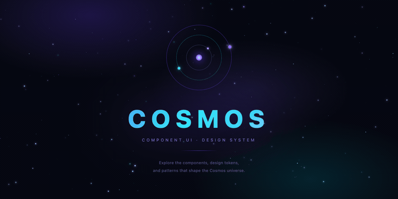

<p align="center"></p>

<h1 align="center">Cosmos UI</h1>

<p align="center">
  A modern, accessible and resilient component library for <strong>React</strong> applications.<br />
  Explore the components, design tokens, and patterns that shape the Cosmos universe.
</p>

<p align="center">
  <a href="https://github.com/LeonardodeLima/cosmos-component-ui/releases"></a>
  <a href="https://github.com/LeonardodeLima/cosmos-component-ui/pkgs/npm/cosmos-component-ui"></a>
  <a href="https://leonardodelima.github.io/cosmos-component-ui/"></a>
  
</p>

---

## Installation

```bash
# npm
npm install @LeonardodeLima/cosmos-component-ui

# yarn
yarn add @LeonardodeLima/cosmos-component-ui
```

> This package is hosted on **GitHub Packages**. Make sure your `.npmrc` is configured:
>
> ```
> @LeonardodeLima:registry=https://npm.pkg.github.com
> ```

---

## Accessibility

All components follow WCAG 2.1 AA guidelines with built-in support for:

- Keyboard navigation
- ARIA attributes (`aria-label`, `aria-pressed`, etc.)
- Sufficient color contrast

---

## Documentation

Explore all components interactively in [Storybook](https://leonardodelima.github.io/cosmos-component-ui/).

---

## License

ISC © [Leonardo de Lima](https://github.com/LeonardodeLima)
